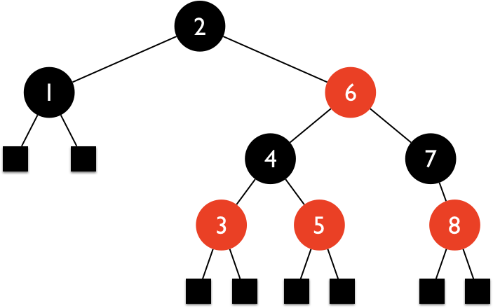
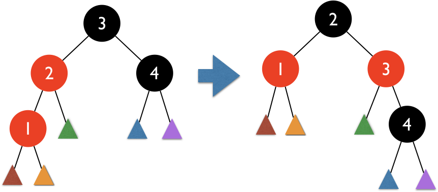
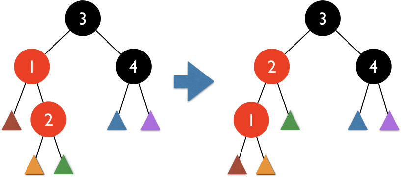

# Balanced Binary Search Trees

## Contents

* [Balanced Binary Search Trees](#balanced-binary-search-trees)
  * [Abstract Balanced Binary Search Tree](#abstract-balanced-binary-search-tree)
* AVL (Adelson-Velskii and Landis) Tree
  * [AVL Node](#avl-node).
  * [AVL Tree](#avl-tree).
* [Red-Black tree](#red-black-tree).
  *
  * 
* [References](#references)

---

## Balanced Binary Search Trees

|            | Search      | Insert               | Delete              |
|:----------:|:-----------:|:--------------------:|:-------------------:|
| Unbalanced | $O(n)$      | $O(n)$               | $O(n) + \beta$      |
| Balanced   | $O(\log n)$ | $O(\log n) + \alpha$ | $O(\log n) + \beta$ |
<br>

### AVL (Adelson-Velskii and Landis) Tree

* Keep the tree _perfectly_ balanced by comparing _heights_ of the subtrees.

### Red-Black Tree

* Keep the tree balanced by matchings _colors_ of the nodes.

---

## Abstract Balanced Binary Search Tree

Source: [`AbstractBalancedBinarySearchTree.java`](../src/main/java/edu/emory/cs/tree/balanced/AbstractBalancedBinarySearchTree.java).

```java
public abstract class AbstractBalancedBinarySearchTree
                      <T extends Comparable<T>, N extends AbstractBinaryNode<T, N>>
                      extends AbstractBinarySearchTree<T, N> {
    @Override
    public N add(T key) {
        N node = super.add(key);
        balance(node);
        return node;
    }

    @Override
    public N remove(T key) {
        N node = findNode(root, key);

        if (node != null) {
            N lowest = node.hasBothChildren() ? removeHibbard(node) : removeSelf(node);
            if (lowest != null && lowest != node) balance(lowest);
        }

        return node;
    }

    /** Preserves the balance of the specific node and its ancestors. */
    protected abstract void balance(N node);
```

* Abstract method: `balance()`.

---

### Rotations


---

```java
protected void rotateLeft(N node) {
    N child = node.getRightChild();

    node.setRightChild(child.getLeftChild());

    if (node.hasParent())
        node.getParent().replaceChild(node, child);
    else
        setRoot(child);

    child.setLeftChild(node);
}

protected void rotateRight(N node) {
    N child = node.getLeftChild();

    node.setLeftChild(child.getRightChild());

    if (node.hasParent())
        node.getParent().replaceChild(node, child);
    else
        setRoot(child);

    child.setRightChild(node);
}
```

---

## AVL Node

Source: [`AVLNode.java`](../src/main/java/edu/emory/cs/tree/balanced/AVLNode.java).

```java
public class AVLNode<T extends Comparable<T>>
             extends AbstractBinaryNode<T, AVLNode<T>> {
    
    private int height;

    public AVLNode(T key) {
        super(key);
        height = 1;
    }

    @Override
    public void setLeftChild(AVLNode<T> node) {
        super.setLeftChild(node);
        resetHeights();
    }

    @Override
    public void setRightChild(AVLNode<T> node) {
        super.setRightChild(node);
        resetHeights();
    }
```

---

### Reset Heights

```java
public void resetHeights() { resetHeightsAux(this); }

private void resetHeightsAux(AVLNode<T> node) {
    if (node != null) {
        int lh = node.hasLeftChild() ? node.getLeftChild().getHeight() : 0;
        int rh = node.hasRightChild() ? node.getRightChild().getHeight() : 0;
        int height = Math.max(lh, rh) + 1;

        if (height != node.getHeight()) {
            node.setHeight(height);
            resetHeightsAux(node.getParent());
        }
    }
}
```


---

### Balance Factor

```java
public int getBalanceFactor() {
    if (hasBothChildren())
        return left_child.getHeight() - right_child.getHeight();
    else if (hasLeftChild())
        return left_child.getHeight();
    else if (hasRightChild())
        return -right_child.getHeight();
    else
        return 0;
}
```


---

## AVL Tree

Source: [`AVLTree.java`](../src/main/java/edu/emory/cs/tree/balanced/AVLTree.java).

```java
public class AVLTree<T extends Comparable<T>>
             extends AbstractBalancedBinarySearchTree<T, AVLNode<T>> {
    @Override
    public AVLNode<T> createNode(T key) {
        return new AVLNode<T>(key);
    }

    @Override
    protected void rotateLeft(AVLNode<T> node) {
        super.rotateLeft(node);
        node.resetHeights();
    }

    @Override
    protected void rotateRight(AVLNode<T> node) {
        super.rotateRight(node);
        node.resetHeights();
    }
```

---

```java
@Override
protected void balance(AVLNode<T> node) {
    if (node == null) return;
    int bf = node.getBalanceFactor();

    if (bf == 2) {
        AVLNode<T> child = node.getLeftChild();

        if (child.getBalanceFactor() == -1)  // case 1
            rotateLeft(child);

        rotateRight(node);  // case 2
    } else if (bf == -2) {
        AVLNode<T> child = node.getRightChild();

        if (child.getBalanceFactor() == 1)  // case 3
            rotateRight(child);

        rotateLeft(node);  // case 4
    } else
        balance(node.getParent());
}
```

* What are the cases 1 - 4?

---

## Red-Black Tree



* Every node is either _red_ or _black_.
* The root and all leaves (_null_) are _black_.
* Every _red_ node must have two _black_ child nodes.
* Every path from a node to any of its _leaves_ must contain the same number of _black_ nodes.

---

### Red-Black Tree

<br>
<br>
* Is the right tree a red-black tree?

---

### Red-Black Tree

<br>
<br>
* Is the right tree a red-black tree?

---

### Red-Black Tree

<br>
<br>
* Is the right tree a red-black tree?

---

Source: [`RedBlackTree.java`](../src/main/java/edu/emory/cs/tree/balanced/RedBlackTree.java).

```java
public class RedBlackTree<T extends Comparable<T>> 
             extends AbstractBalancedBinarySearchTree<T, RedBlackNode<T>> {
    public RedBlackNode<T> createNode(T key) {
        return new RedBlackNode<T>(key);
    }

    protected void balance(RedBlackNode<T> node) {
        if (isRoot(node))
            node.setToBlack();
        else if (node.getParent().isRed()) {
            RedBlackNode<T> uncle = node.getUncle();

            if (uncle != null && uncle.isRed())
                balanceWithRedUncle(node, uncle);
            else
                balanceWithBlackUncle(node);
        }
    }
```

```java
private void balanceWithRedUncle(RedBlackNode<T> node, RedBlackNode<T> uncle) {
    node.getParent().setToBlack();
    uncle.setToBlack();
    RedBlackNode<T> grandParent = node.getGrandParent();
    grandParent.setToRed();
    balance(grandParent);
}
```
---

```java
private void balanceWithBlackUncle(RedBlackNode<T> node) {
    RedBlackNode<T> grandParent = node.getGrandParent();

    if (grandParent != null) {
        RedBlackNode<T> parent = node.getParent();

        if (grandParent.isLeftChild(parent) && parent.isRightChild(node)) {  // case 1
            rotateLeft(parent);
            node = parent;
        }
        else if (grandParent.isRightChild(parent) && parent.isLeftChild(node)) {  // case 2
            rotateRight(parent);
            node = parent;
        }

        node.getParent().setToBlack();
        grandParent.setToRed();

        if (node.getParent().isLeftChild(node))        // case 3
            rotateRight(grandParent);
        else
            rotateLeft(grandParent);            // case 4
    }
}
```

* What are the cases 1 - 4?

---

## References

* [AVL Tree](https://en.wikipedia.org/wiki/AVL_tree).
* [Red-Black Tree](https://en.wikipedia.org/wiki/Red–black_tree).