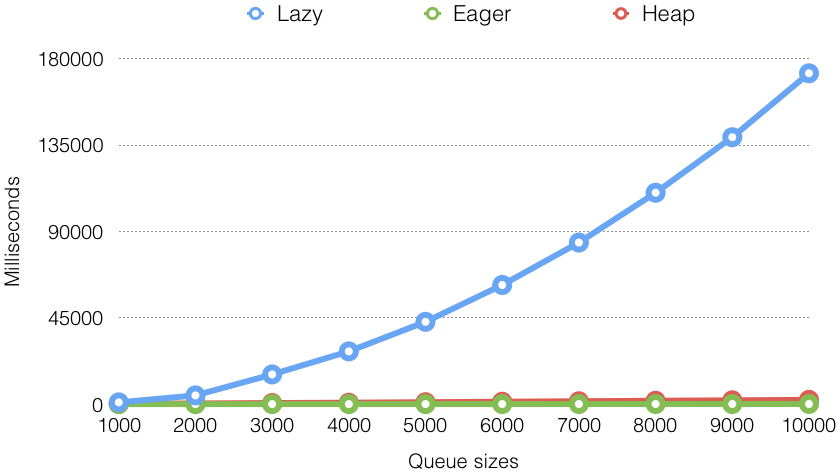
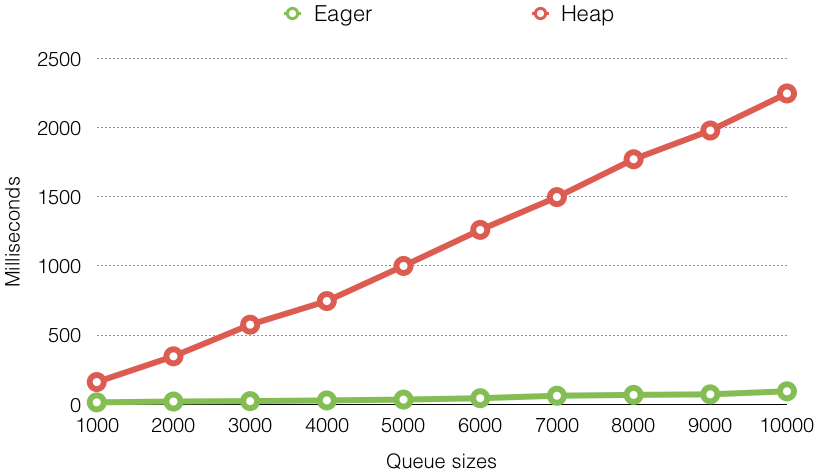

# Priority Queues

## Contents

* [Abstract Priority Queue](#abstract-priority-queue).
* [Lazy Priority Queue](#lazy-priority-queue).
* [Eager Priority Queue](#eager-priority-queue).
* [Binary Heap](#binary-heap).
* [Unit Tests](#unit-tests).
* [References](#references).

---

## Abstract Priority Queue

Source: [`AbstractPriorityQueue.java`](../src/main/java/edu/emory/cs/queue/AbstractPriorityQueue.java)

```java
public abstract class AbstractPriorityQueue<T extends Comparable<T>> {
    protected Comparator<T> comparator;

    public AbstractPriorityQueue(Comparator<T> comparator) {
        this.comparator = comparator;
    }
```

* Class types: `class` vs. `abstract class` vs. `interface`.
* [Generics](https://en.wikipedia.org/wiki/Generics_in_Java): `<T extends Comparable<T>>`.
* Interface in generics: `Comparable`.
* Member types: `private` vs. `package` vs. `protected` vs. `public`.
* Constructor: `this`.

---

```java
    /**
     * Adds a comparable key to this queue.
     * @param key the comparable key.
     */
    abstract public void add(T key);

    /**
     * Removes the key with the highest priority if exists.
     * @return the key with the highest priority if exists; otherwise, {@code null}.
     */
    abstract public T remove();

    /** @return the size of this queue. */
    abstract public int size();

    /** @return {@code true} if the queue is empty; otherwise, {@code false}. */
    public boolean isEmpty() {
        return size() == 0;
    }
```  

* Abstract methods: `add()`, `remove()`, `size()`.
* Regular method in abstract class: `isEmpty()`.
* [Javadoc](https://docs.oracle.com/en/java/javase/12/docs/api/).

---

## Lazy Priority Queue

Source: [`LazyPriorityQueue.java`](../src/main/java/edu/emory/cs/queue/LazyPriorityQueue.java)

```java
public class LazyPriorityQueue<T extends Comparable<T>> extends AbstractPriorityQueue<T> {
    private List<T> keys;

    public LazyPriorityQueue(Comparator<T> comparator) {
        super(comparator);
        keys = new ArrayList<>();
    }

    public LazyPriorityQueue() {
        this(Comparator.naturalOrder());
    }
```

* Class inheritance: `extends AbstractPriorityQueue<T>`.
* Constructors: default vs. parameters, `this` vs. `super`.

---

```java
    /**
     * Adds a key to the back of the list.
     * @param key the comparable key.
     */
    @Override
    public void add(T key) { keys.add(key); }

    /**
     * Finds the key with the highest priority, and removes it from the list.
     * @return the key with the highest priority if exists; otherwise, {@code null}.
     */
    @Override
    public T remove() {
        if (isEmpty()) return null;
        T max = Collections.max(keys, comparator);
        keys.remove(max);
        return max;
    }

    @Override
    public int size() { return keys.size(); }
```

* Annotation: `@Override`.
* Edge case handling: `remove()`.
* Base API: `Collections.max()`.
* Complexity: `add()`, `remove()`.

---

## Eager Priority Queue

Source: [`EagerPriorityQueue.java`](../src/main/java/edu/emory/cs/queue/EagerPriorityQueue.java)

```java
    /**
     * Adds a key to the list according to the priority.
     * @param key the comparable key.
     */
    @Override
    public void add(T key) {
        int index = Collections.binarySearch(keys, key, comparator);
        if (index < 0) index = -(index + 1);
        keys.add(index, key);
    }

    /**
     * Remove the last key in the list.
     * @return the key with the highest priority if exists; otherwise, {@code null}.
     */
    @Override
    public T remove() {
        return isEmpty() ? null : keys.remove(keys.size() - 1);
    }
```

* Base API: `Collections.binarySearch()`.
* Ternary conditional operator: `condition ? : `.
* Complexity: `add()`, `remove()`.

---

## Binary Heap

### What is a heap?

* A _tree_ where each node has a _higher_ (or equal) priority than its children.
* The tree must be _balanced_ at all time.
* What is a _binary_ heap?

### Operations
* Add: _swim_.
* Remove: _sink_.
* Both operations can be done in _$O(\log n)$_.

---

### Representation

* Binary heap can be represented by a _list_.
* Index of the parent: _$k/2$_.
* Index of the children: _$k*2$_ and _$(k*2) + 1$_.

  <br>

---

Source: [`BinaryHeap.java`](../src/main/java/edu/emory/cs/queue/BinaryHeap.java)

```java
public class BinaryHeap<T extends Comparable<T>> extends AbstractPriorityQueue<T> {
    private List<T> keys;

    public BinaryHeap(Comparator<T> comparator) {
        super(comparator);
        keys = new ArrayList<>();
        keys.add(null);    // initialize the first item as null
    }

    public BinaryHeap() {
        this(Comparator.naturalOrder());
    }

    @Override
    public int size() {
        return keys.size() - 1;
    }
```

* Handle the `null` key at the front.

---

```java
    @Override
    public void add(T key) {
        keys.add(key);
        swim(size());
    }

    private void swim(int k) {
        while (1 < k && comparator.compare(keys.get(k / 2), keys.get(k)) < 0) {
            Collections.swap(keys, k / 2, k);
            k /= 2;
        }
    }
```

* Add each key to the end of the list and _swim_.
* `comparator.compare()`: compare itself to its parent.
* Base API: `Collections.swap()`.

---

```java
    @Override
    public T remove() {
        if (isEmpty()) return null;
        Collections.swap(keys, 1, size());
        T max = keys.remove(size());
        sink(1);
        return max;
    }

    private void sink(int k) {
        for (int i = k * 2; i <= size(); k = i, i *= 2) {
            if (i < size() && comparator.compare(keys.get(i), keys.get(i + 1)) < 0) i++;
            if (comparator.compare(keys.get(k), keys.get(i)) >= 0) break;
            Collections.swap(keys, k, i);
        }
    }
```

* Replace the root with the last key in the list and _sink_.
* Compare two children.
* Compare itself to the greater child.

---

## Unit Tests

Source: [`PriorityQueueTest.java`](../src/test/java/edu/emory/cs/queue/PriorityQueueTest.java)

### Accuracy

```java
/**
 * @param q a priority queue.
 * @param c a comparator used for sorting.
 * @param keys a list of comparable keys.
 */
private <T extends Comparable<T>>void testAccuracy(AbstractPriorityQueue<T> q, Comparator<T> c, List<T> keys) {
    keys.forEach(q::add);
    keys.sort(c);
    keys.forEach(key -> assertEquals(key, q.remove()));
}

@Test
public void testAccuracy() {
    testAccuracy(new LazyPriorityQueue<>(), Comparator.reverseOrder());
    testAccuracy(new EagerPriorityQueue<>(), Comparator.reverseOrder());
    testAccuracy(new BinaryHeap<>(), Comparator.reverseOrder());

    testAccuracy(new LazyPriorityQueue<Integer>(Comparator.reverseOrder()), Comparator.naturalOrder());
    testAccuracy(new EagerPriorityQueue<Integer>(Comparator.reverseOrder()), Comparator.naturalOrder());
    testAccuracy(new BinaryHeap<Integer>(Comparator.reverseOrder()), Comparator.naturalOrder());
}
```

* Generics on method.
* Lambda expression: `Iterable.forEach()`.
* Annotation: `@Test`.

---

### Speed

```java
private class Time {
    long add;
    long remove;
}

private void addRuntime(AbstractPriorityQueue<Integer> q, Time t, int[] keys) {
    long st, et;

    // runtime for q.add()
    st = System.currentTimeMillis();
    Arrays.stream(keys).forEach(q::add);
    et = System.currentTimeMillis();
    t.add += et - st;

    // runtime for q.remove()
    st = System.currentTimeMillis();
    while (!q.isEmpty()) q.remove();
    et = System.currentTimeMillis();
    t.remove += et - st;
}
```

* Class type: `private class`.
* Constructor type: default constructor.
* Base API: `System.currentTimeMillis()`.
* Lambda expression: `Arrays.stream()`. 

---

```java
private Time[] benchmark(AbstractPriorityQueue<Integer>[] qs, int iter, int size) {
    Time[] ts = Stream.generate(Time::new).limit(qs.length).toArray(Time[]::new);
    Random rand = new Random();

    for (int i = 0; i < iter; i++) {
        int[] keys = Utils.getRandomIntArray(rand, size);

        for (int j = 0; j < qs.length; j++)
            addRuntime(qs[j], ts[j], keys);
    }

    return ts;
}

private void testSpeed(AbstractPriorityQueue<Integer>... qs) {
    for (int size = 1000; size <= 10000; size += 1000) {
        // JVM warmup
        benchmark(qs, 10, size);
        // benchmark all priority queues with the same keys
        Time[] times = benchmark(qs, 1000, size);
    }
}

@Test
public void testSpeed() {
    testSpeed(new LazyPriorityQueue<>(), new EagerPriorityQueue<>(), new BinaryHeap<>());
}
```
* Variable Arguments: `AbstractPriorityQueue<Integer>... qs`.
* Lambda expression: `Stream.generate().limit().toArray()`.

---

### Speed Comparison - Add


* Lazy: _$O(1)$_ vs. Eager: _$O(\log n)$_? vs. Heap: _$O(\log n)$_.

---

### Speed Comparison - Add


* Lazy: _$O(1)$_ vs. Heap: _$O(\log n)$_.

---

### Speed Comparison - Remove



* Lazy: _$O(n)$_, Eager: _$O(1)$_, Heap: _$O(\log n)$_.

---

### Speed Comparison - Remove



* Eager: _$O(1)$_, Heap: _$O(\log n)$_.

---

## References

* [Priority queue](https://en.wikipedia.org/wiki/Priority_queue).
* [Binary heap](https://en.wikipedia.org/wiki/Binary_heap).
* Java Base API:
  * [Comparable](https://docs.oracle.com/en/java/javase/12/docs/api/java.base/java/lang/Comparable.html).
  * [Collections](https://docs.oracle.com/en/java/javase/12/docs/api/java.base/java/util/Collections.html): `max()`, `swap()`, `binarySearch()`.
  * [Iterable](https://docs.oracle.com/en/java/javase/12/docs/api/java.base/java/lang/Iterable.html): `forEach()`.
  * [Arrays](https://docs.oracle.com/en/java/javase/12/docs/api/java.base/java/util/Arrays.html): `forEach()`.
  * [Stream](https://docs.oracle.com/en/java/javase/12/docs/api/java.base/java/util/stream/Stream.html): `generate()`, `limit()`, `toArray()`.
* Java Annotation:
  * [@Override](https://docs.oracle.com/en/java/javase/12/docs/api/java.base/java/lang/Override.html).
  * [@Test](http://junit.sourceforge.net/javadoc/org/junit/Test.html).
