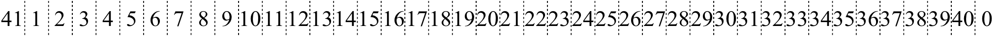
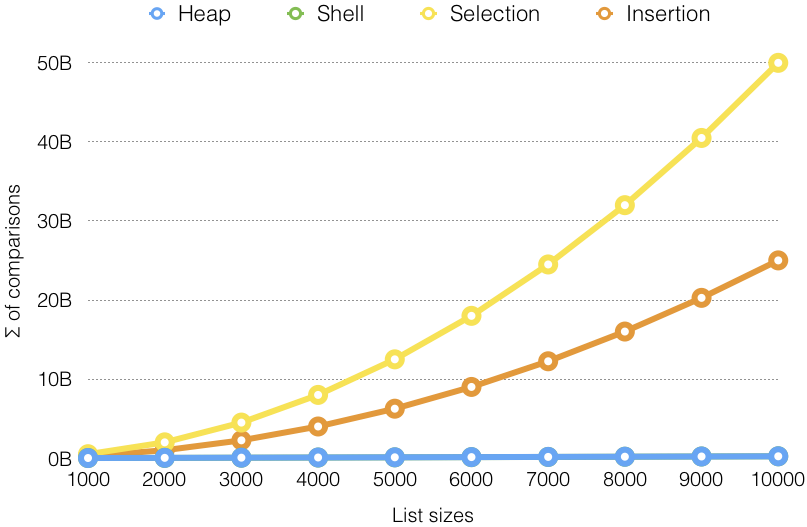
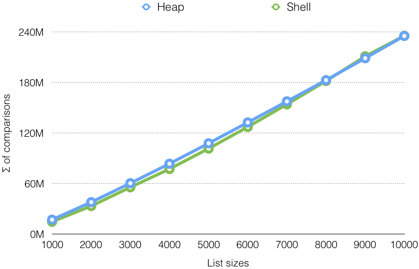
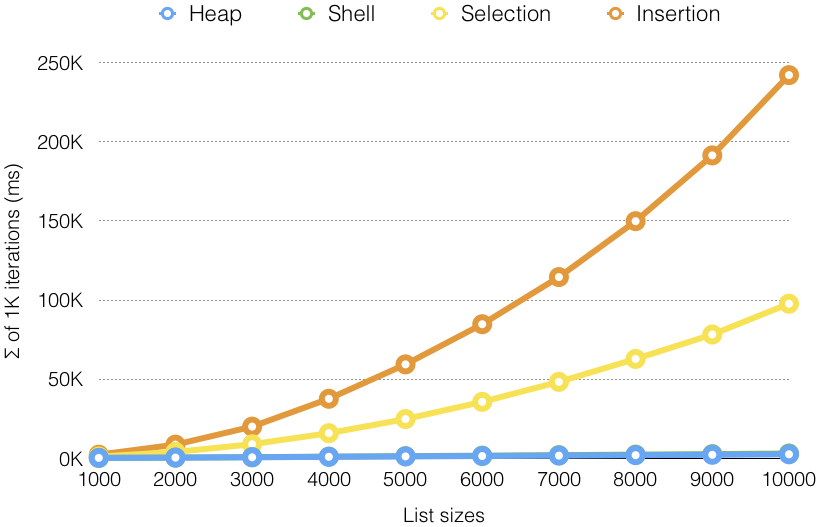
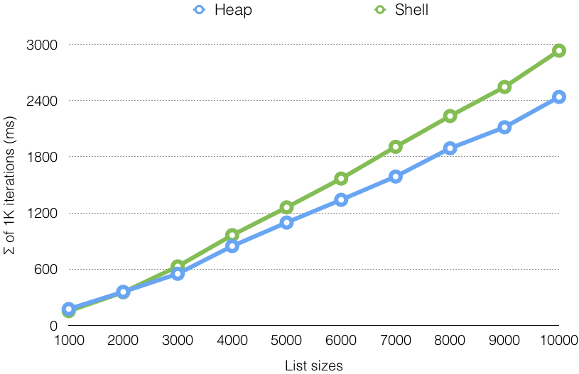
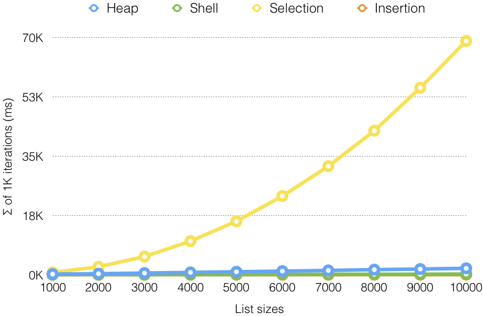
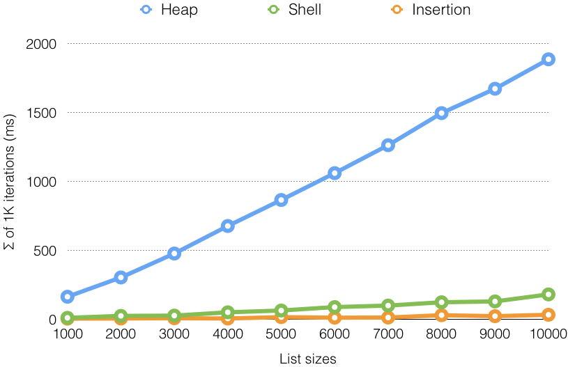

# Sort: Comparison-based

## Contents

* [Sorting Algorithms](#sorting-algorithms).
  * [Abstract Sort](#abstract-sort).
* [Selection-based Sort](#selection-based-sort).
  * [Selection Sort](#selection-sort).
  * [Heap Sort](#heap-sort).
* [Insertion-based Sort](#insertion-based-sort).
  * [Insertion Sort](#insertion-sort).
  * [Shell Sort](#shell-sort).
* [Benchmarks](#benchmarks).
* [References](#references).

---

## Sorting Algorithms

* What is the best soring algorithm?


---

## Abstract Sort

Source: [`AbstractSort.java`](../src/main/java/edu/emory/cs/sort/AbstractSort.java)

```java
public abstract class AbstractSort<T extends Comparable<T>> {
    protected Comparator<T> comparator;
    protected long comparisons;  // total # of comparisons performed
    protected long assignments;  // total # of assignments performed

    public AbstractSort(Comparator<T> comparator) {
        this.comparator = comparator;
        resetCounts();
    }

    public long getComparisonCount() { return comparisons; }

    public long getAssignmentCount() { return assignments; }

    public void resetCounts() { comparisons = assignments = 0; }
```

* Benchmark: `comparisons`, `assignments`.
* Default instance values vs. `resetCounts()`.

---

```java
    protected int compareTo(T[] array, int i, int j) {
        comparisons++;
        return comparator.compare(array[i], array[j]);
    }

    protected void assign(T[] array, int index, T value) {
        assignments++;
        array[index] = value;
    }

    protected void swap(T[] array, int i, int j) {
        T t = array[i];
        assign(array, i, array[j]);
        assign(array, j, t);
    }

    public void sort(T[] array) { sort(array, 0, array.length); }

    /**
     * Sorts the array[beginIndex:endIndex].
     * @param beginIndex the index of the first key to be sorted (inclusive).
     * @param endIndex the index of the last key to be sorted (exclusive).
     */
    abstract public void sort(T[] array, int beginIndex, int endIndex);    
```

* Abstract method: `sort()`.

---

## Selection-based Sort

### Algorithm

* For each key _$A_i$_ where $|A| = n\:$ and $\:i \in [0, n-1)$:
  * Search the minimum key _$A_{m}$_ where $m \in [i+1, n)$.
  * Swap _$A_{i}$_ and _$A_{m}$_.

### Complexity

|           | Search | Compare       | Swap          |
|:---------:|:------:|:-------------:|:-------------:|
| Selection | Linear | $O(n^2)$      | $O(n)$        |
| Heap      | Heap   | $O(n \log n)$ | $O(n \log n)$ |

---

## Selection Sort

Source: [`SelectionSort.java`](../src/main/java/edu/emory/cs/sort/comparison/SelectionSort.java)

```java
@Override
public void sort(T[] array, final int beginIndex, final int endIndex) {
    for (int i = beginIndex; i < endIndex - 1; i++) {
        int min = i;

        for (int j = i + 1; j < endIndex; j++) {
            if (compareTo(array, j, min) < 0)
                min = j;
        }

        swap(array, i, min);
    }
}
```

* How many _comparisons_ and _assignments_?

---

## Heap Sort

Source: [`HeapSort.java`](../src/main/java/edu/emory/cs/sort/comparison/HeapSort.java)

```java
private void sink(T[] array, int k, int beginIndex, int endIndex) {
    for (int i = getLeftChildIndex(beginIndex, k);
             i < endIndex; k = i, i = getLeftChildIndex(beginIndex, k)) {
        if (i + 1 < endIndex && compareTo(array, i, i + 1) < 0) i++;
        if (compareTo(array, k, i) >= 0) break;
        swap(array, k, i);
    }
}

private int getLeftChildIndex(int beginIndex, int k) {
    return beginIndex + 2 * (k - beginIndex) + 1;
}
```

* Sink `array[k]` iteratively to heapify.
* Increment statement: `k = i, i = getLeftChildIndex(beginIndex, k)`.

---

```java
@Override
public void sort(T[] array, int beginIndex, int endIndex) {
    // heapify
    for (int k = getParentIndex(beginIndex, endIndex); k >= beginIndex; k--)
        sink(array, k, beginIndex, endIndex);

    // swap
    while (endIndex > beginIndex + 1) {
        swap(array, beginIndex, --endIndex);
        sink(array, beginIndex, beginIndex, endIndex);
    }
}

private int getParentIndex(int beginIndex, int k) {
    return beginIndex + (k - beginIndex) / 2 - 1;
}   
```

* Sink all _non-leaf_ nodes to construct a heap.
* Swap the _rightmost leaf_ with the _root_, and sink.
* How many _comparisons_ and _assignments_?

---

## Insertion-based Sort

### Algorithm

* For each key _$A_i$_ where $|A| = n\:$ and $\:i \in [1, n)$:
  * Keep swapping _$A_{i-1}$_ and _$A_{i}$_ until $A_{i-1} \leq A_i$.

### Complexity

|           | Pair              | Compare      | Swap         |
|:---------:|:-----------------:|:------------:|:------------:|
| Insertion | Adjacent          | $O(n^2)$     | $O(n^2)$     |
| Shell     | Knuth Sequence    | $O(n^{1.5})$ | $O(n^{1.5})$ |


---

## Insertion Sort

Source: [`InsertionSort.java`](../src/main/java/edu/emory/cs/sort/comparison/InsertionSort.java)

```java
@Override
public void sort(T[] array, int beginIndex, int endIndex) {
    sort(array, beginIndex, endIndex, 1);
}

protected void sort(T[] array, int beginIndex, int endIndex, final int h) {
    int begin_h = beginIndex + h;

    for (int i = begin_h; i < endIndex; i++)
        for (int j = i; j >= begin_h && compareTo(array, j, j - h) < 0; j -= h)
            swap(array, j, j - h);
}
```

* Parameter: `h` (_gap_ between two keys that are compared).
* How many _comparisons_ and _assignments_?
* How many _swaps_ for the following array?



---

## Shell Sort

### Algorithm

* _Group_ keys whose distance is defined by a _sequence_.
* Sort each group using _insertion sort_.

### Sequences

* _Knuth_: $(3^k - 1) / 2 \Rightarrow \{1, 4, 13, 40, 121, \ldots\}$.
* _Hibbard_: $2^k - 1 \Rightarrow \{1, 3, 7, 15, 31, 63, \ldots\}$.
* _Pratt_: $2^p \cdot 3^q \Rightarrow \{1, 2, 3, 4, 6, 8, 9, 12, \ldots\}$.
* _Shell_: $n / 2^k \Rightarrow \{500, 250, 125, \ldots\}$, where $n = 1000$.


* Knuth sequence: $\{13, 4, 1\} < n / 3$, where $n = 40$.
* Only 4 keys to swaps!

---

Source: [`ShellSort.java`](../src/main/java/edu/emory/cs/sort/comparison/ShellSort.java)

```java
public abstract class ShellSort<T extends Comparable<T>> extends InsertionSort<T> {
    protected List<Integer> sequence;

    /** @param n the expected size of the list to be sorted. */
    public ShellSort(Comparator<T> comparator, int n) {
        super(comparator);
        sequence = new ArrayList<>();
        populateSequence(n);
    }

    /**
     * Populates the gap sequence with respect to the list size.
     * @param n the size of the list to be sorted.
     */
    protected abstract void populateSequence(int n);

    /**
     * @param n the size of the list to be sorted.
     * @return the starting index of the sequence with respect to the list size.
     */
    protected abstract int getSequenceStartIndex(int n);
```

* Inheritance: `InsertionSort`.
* Pre-populate the sequence: `populateSequence()`.

---

```java
@Override
public void sort(T[] array, int beginIndex, int endIndex) {
    int n = endIndex - beginIndex;
    populateSequence(n);

    for (int i = getSequenceStartIndex(n); i >= 0; i--)
        sort(array, beginIndex, endIndex, sequence.get(i));
}
```

* How often is `populateSequence()` getting called?

From [`InsertionSort.java`](../src/main/java/edu/emory/cs/sort/comparison/InsertionSort.java):

```java
protected void sort(T[] array, int beginIndex, int endIndex, final int h) {
    int begin_h = beginIndex + h;

    for (int i = begin_h; i < endIndex; i++)
        for (int j = i; j >= begin_h && compareTo(array, j, j - h) < 0; j -= h)
            swap(array, j, j - h);
}
```

---

Source: [`ShellSortKnuth.java`](../src/main/java/edu/emory/cs/sort/comparison/ShellSortKnuth.java)

```java
public class ShellSortKnuth<T extends Comparable<T>> extends ShellSort<T> {
    public ShellSortKnuth(Comparator<T> comparator) {
        this(comparator, 1000);
    }

    public ShellSortKnuth(Comparator<T> comparator, int n) {
        super(comparator, n);
    }

    @Override
    protected void populateSequence(int n) {
        n /= 3;

        for (int t = sequence.size() + 1; ; t++) {
            int h = (int) ((Math.pow(3, t) - 1) / 2);
            if (h <= n) sequence.add(h);
            else break;
        }
    }
```

* Upper bound: `n /= 3`.
* How many keys are added when `populateSequence()` is called?

---

```java
@Override
protected int getSequenceStartIndex(int n) {
    int index = Collections.binarySearch(sequence, n / 3);
    if (index < 0) index = -(index + 1);
    if (index == sequence.size()) index--;
    return index;
}
```

* When is `index == sequence.size()` satisfied?

---

## Unit Tests

Source: [`SortTest.java`](../src/test/java/edu/emory/cs/sort/SortTest.java)

```java
@Test
public void testAccuracy() {
    final int iter = 100;
    final int size = 100;

    testAccuracy(iter, size, new SelectionSort<>());
    testAccuracy(iter, size, new InsertionSort<>());
    testAccuracy(iter, size, new HeapSort<>());
    testAccuracy(iter, size, new ShellSortKnuth<>());
}

private void testAccuracy(final int iter, final int size, AbstractSort<Integer> engine) {
    final Random rand = new Random();
    Integer[] original, sorted;

    for (int i = 0; i < iter; i++) {
        original = Stream.generate(rand::nextInt).limit(size).toArray(Integer[]::new);
        sorted = Arrays.copyOf(original, size);
        engine.sort(original);
        Arrays.sort(sorted);
        assertArrayEquals(original, sorted);
    }
}
```

* Base API: `Arrays.copyOf()`, `Arrays.sort()`.

---

## Benchmarks

### Comparison Complexities

|         | Selection | Heap          | Insertion    | Shell (Knuth) |
|:-------:|:---------:|:-------------:|:------------:|:-------------:|
| Best    | $O(n^2)$  | $O(n \log n)$ | $O(n)$       | $O(n)$        |
| Worst   | $O(n^2)$  | $O(n \log n)$ | $O(n^2)$     | $O(n^{1.5})$  |
| Average | $O(n^2)$  | $O(n \log n)$ | $O(n^2)$     | $O(n^{1.5})$  |

---


### Number of Comparisons (Random)

<br>

---

### Number of Comparisons (Random)

<br>

---

### Number of Assignments (Random)

<br>

---

### Number of Assignments (Random)

<br>

---

### Speed Comparison (Random)

<br>

---

### Speed Comparison (Random)

<br>

---

### Speed Comparison (Ascending)

<br>

---

### Speed Comparison (Ascending)

<br>

---

### Speed Comparison - Descending

<br>

---

### Speed Comparison - Descending

<br>

---

## References

* [Selection sort](https://en.wikipedia.org/wiki/Selection_sort).
* [Insertion sort](https://en.wikipedia.org/wiki/Insertion_sort).
* [Heapsort](https://en.wikipedia.org/wiki/Heapsort).
* [Shellsort](https://en.wikipedia.org/wiki/Shellsort).
