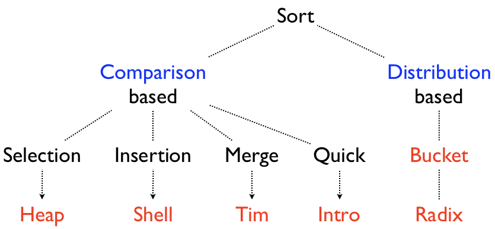
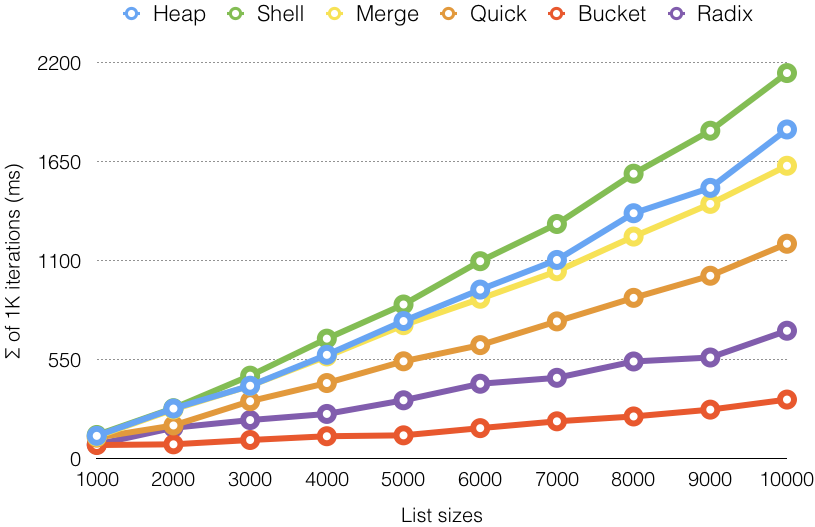

# Sort: Distribution-based

## Contents

* [Sorting Algorithms](#sorting-algorithms).
* [Bucket Sort](#bucket-sort).
  * [Integer Bucket Sort](#integer-bucket-sort).
* [Radix Sort](#radix-sort).
  * [LSD Radix Sort](#lsd-radix-sort).
* [Benchmarks](#benchmarks).
* [References](#references).

---

## Sorting Algorithms

* What is the best soring algorithm?



---

## Bucket Sort

Source: [`BucketSort.java`](../src/main/java/edu/emory/cs/sort/distribution/BucketSort.java)

```java
public abstract class BucketSort<T extends Comparable<T>> extends AbstractSort<T> {
    protected List<Deque<T>> buckets;

    /** @param numBuckets the total number of buckets.  */
    public BucketSort(int numBuckets) {
        super(null);

        buckets = Stream.generate(ArrayDeque<T>::new)
                        .limit(numBuckets)
                        .collect(Collectors.toList());
    }
```

* Comparator?
* How many buckets need to be intialized?
* Base API: `ArrayDeque`.

---

```java
protected void sort(T[] array, int beginIndex, int endIndex, Function<T, T> f) {
    // add each element in the input array to the corresponding bucket
    for (int i = beginIndex; i < endIndex; i++)
        buckets.get(getBucketIndex(array[i], f)).add(array[i]);

    // merge elements in all buckets to the input array
    for (Deque<T> bucket : buckets) {
        while (!bucket.isEmpty())
            array[beginIndex++] = bucket.remove();
    }
}

/**
 * @param key a comparable key.
 * @param f takes one argument of type T, and return a value of type T (optional).
 * @return the index of the bucket that the key should be inserted.
 */
abstract protected int getBucketIndex(T key, Function<T, T> f);
```

* Method: `getBucketIndex()`, `bucket.removeLast()`.

---

## Integer Bucket Sort

Source: [`IntegerBucketSort.java`](../src/main/java/edu/emory/cs/sort/distribution/IntegerBucketSort.java)

```java
public class IntegerBucketSort extends BucketSort<Integer> {
    private final int GAP;

    /**
     * @param min the minimum integer (inclusive).
     * @param max the maximum integer (exclusive).
     */
    public IntegerBucketSort(int min, int max) {
        super(max - min);
        GAP = -min;
    }

    @Override
    public void sort(Integer[] array, int beginIndex, int endIndex) {
        sort(array, beginIndex, endIndex, null);
    }

    @Override
    protected int getBucketIndex(Integer key, Function<Integer, Integer> f) {
        return key + GAP;
    }
}
```

* The purpose of `GAP`?

---

## Radix Sort

Source: [`RadixSort.java`](../src/main/java/edu/emory/cs/sort/distribution/RadixSort.java)

```java
public abstract class RadixSort extends BucketSort<Integer> {
    public RadixSort() { super(10); }

    @Override
    protected int getBucketIndex(Integer key, Function<Integer, Integer> f) {
        return f.apply(key) % 10;
    }

    protected int getMaxBit(Integer[] array, int beginIndex, int endIndex) {
        Integer max = Arrays.stream(array, beginIndex, endIndex)
                            .reduce(Integer::max)
                            .orElse(null);
        return (max != null && max > 0) ? (int)Math.log10(max) + 1 : 0;
    }

```

* Exception handling: `throw new UnsupportedOperationException()`.
* `getMaxBit()`: return the order of the most significant digit in the input array.

---

## LSD Radix Sort

Source: [`LSDRadixSort.java`](../src/main/java/edu/emory/cs/sort/distribution/LSDRadixSort.java)

```java
public class LSDRadixSort extends RadixSort {
    @Override
    public void sort(Integer[] array, int beginIndex, int endIndex) {
        int maxBit = getMaxBit(array, beginIndex, endIndex);
        for (int bit = 0; bit < maxBit; bit++) {
            int div = (int) Math.pow(10, bit);
            sort(array, beginIndex, endIndex, k -> k / div);
        }
    }
}
```

* Lambda function: `k -> k / div`.

---

## Benchmarks

### Speed Comparison

<br>

---

## References

* [Bucket sort](http://en.wikipedia.org/wiki/Bucket_sort).
* [Radix sort](http://en.wikipedia.org/wiki/Radix_sort).
